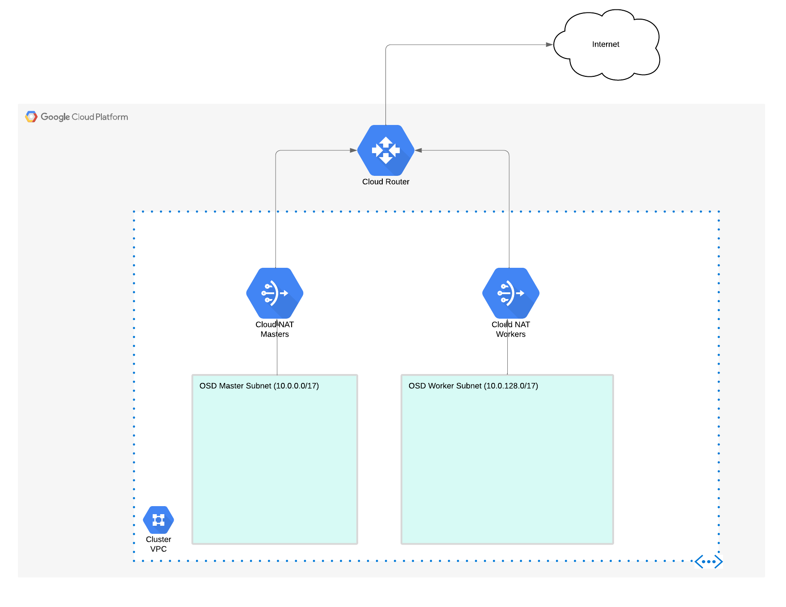
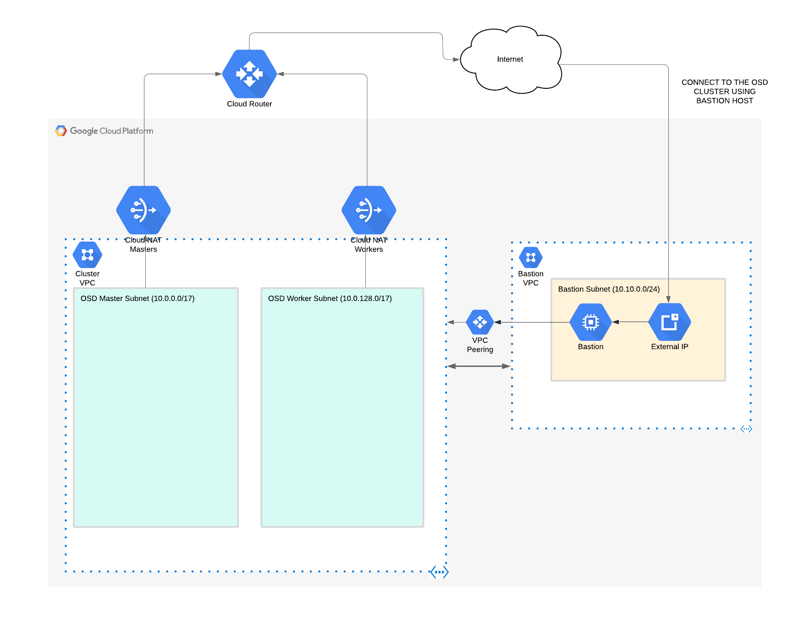

# OpenShift Dedicated for GCP in Pre-Existing VPCs & in Private Mode

Automation Code for deploy and manage OpenShift Dedicated in GCP in Pre-Existing VPCs & Private Mode

### Useful notes before you start

* Follow the guide [here](https://docs.openshift.com/dedicated/osd_install_access_delete_cluster/creating-a-gcp-cluster.html#osd-create-gcp-cluster-ccs_osd-creating-a-cluster-on-gcp) to set up your GCP service account
* Export the location of your json file using: `export GOOGLE_APPLICATION_CREDENTIALS=$PATH_TO_JSON_FILE`


* Note: if your ssh key is not `~/.ssh/id_rsa.pub`, set this using:

```bash
export TF_VAR_bastion_key_loc=$PATH_TO_PUBLIC_KEY
```

## OSD in GCP in Pre-Existing VPCs / Subnets



* Copy and modify the tfvars file in order to custom to your scenario

```bash
cp -pr terraform.tfvars.example terraform.tfvars
```

* Deploy the network infrastructure in GCP needed for deploy the OSD cluster

```bash
make all
```

* or if you want to do it manually:

```bash
export ENVIRONMENT="lab"
export TF_BACKEND_CONF="configuration/backend"
export TF_VARIABLES="configuration/tfvars"

terraform init -backend-config="$TF_BACKEND_CONF/$ENVIRONMENT.conf"
terraform plan -var-file="$TF_VARIABLES/terraform.tfvars" -out "output/tf.$ENVIRONMENT.plan"
terraform apply output/tf.$ENVIRONMENT.plan
```

* Follow the [OSD in GCP install link](https://docs.openshift.com/dedicated/osd_install_access_delete_cluster/creating-a-gcp-cluster.html#osd-create-gcp-cluster-ccs_osd-creating-a-cluster-on-gcp)

## OSD in GCP in Private Mode



NOTE: this will be deploying also the Bastion host that will be used for connect to the OSD private cluster.

* Setup to true these two variables, in your terraform.tfvars.

```bash
enable_osd_gcp_bastion = true
osd_gcp_private = true
```

* Deploy the network infrastructure in GCP needed for deploy the OSD cluster

```bash
make all
```

* or if you want to do it manually:

```bash
export ENVIRONMENT="lab"
export TF_BACKEND_CONF="configuration/backend"
export TF_VARIABLES="configuration/tfvars"

terraform init -backend-config="$TF_BACKEND_CONF/$ENVIRONMENT.conf"
terraform plan -var-file="$TF_VARIABLES/terraform.tfvars" -out "output/tf.$ENVIRONMENT.plan"
terraform apply output/tf.$ENVIRONMENT.plan
```

* Follow the [OSD in GCP install link](https://docs.openshift.com/dedicated/osd_install_access_delete_cluster/creating-a-gcp-cluster.html#osd-create-gcp-cluster-ccs_osd-creating-a-cluster-on-gcp)
