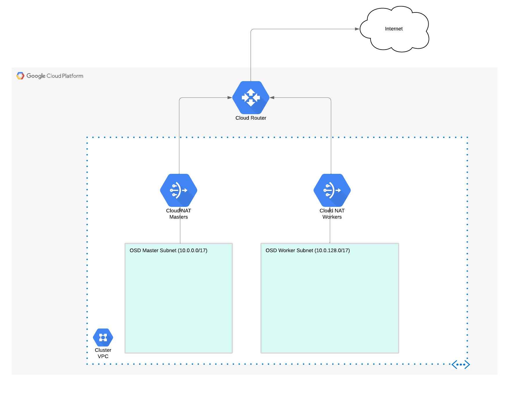
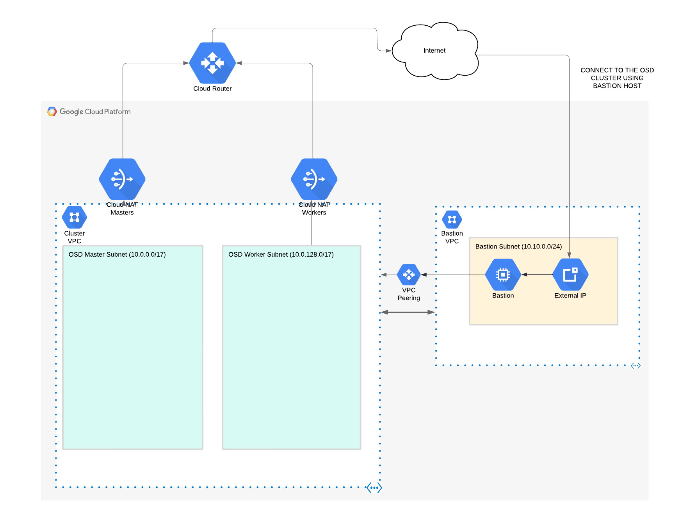

# OpenShift Dedicated for GCP in Pre-Existing VPCs & in Private Mode

Automation Code for deploy and manage OpenShift Dedicated in GCP in Pre-Existing VPCs & Private Mode

### Authentication

Pick one of two options for the installer and cluster to access GCP resources in your account, Workload Identity Federation, or Service Account.

#### Workload Identity Federation

[Workload Identity Federation](https://docs.openshift.com/dedicated/osd_gcp_clusters/creating-a-gcp-cluster-with-workload-identity-federation.html#workload-identity-federation-overview_osd-creating-a-cluster-on-gcp-with-workload-identity-federation) is the preferred method of authentication that uses short-lived credentials.

1. Follow the general [Required customer procedure](https://docs.openshift.com/dedicated/osd_planning/gcp-ccs.html#ccs-gcp-customer-procedure_gcp-ccs)
1. Follow the specific [Workload Identity Federation authentication type procedure](https://docs.openshift.com/dedicated/osd_planning/gcp-ccs.html#ccs-gcp-customer-procedure-wif_gcp-ccs)
1. Set the `gcp_authentication_type` Terraform variable using `export TF_VAR_gcp_authentication_type=workload_identity_federation`.
1. Optionally, if you have configured a bastion, and your ssh key is not `~/.ssh/id_rsa.pub`, set its location using ` export TF_VAR_bastion_key_loc=$PATH_TO_PUBLIC_KEY`

#### Service Account

[Service Account](https://docs.openshift.com/dedicated/osd_gcp_clusters/creating-a-gcp-cluster-sa.html#service-account-auth-overview_osd-creating-a-cluster-on-gcp-sa) authentication uses a public/private keypair with broader permissions than WIF.

1. Follow the general [Required customer procedure](https://docs.openshift.com/dedicated/osd_planning/gcp-ccs.html#ccs-gcp-customer-procedure_gcp-ccs)
1. Follow the specific [Service account authentication type procedure](https://docs.openshift.com/dedicated/osd_planning/gcp-ccs.html#ccs-gcp-customer-procedure-sa_gcp-ccs)
1. Export the location of your `osd-ccs-admin` service account key json file using `export TF_VAR_gcp_sa_file_loc=$PATH_TO_JSON_FILE`
1. Set the `gcp_authentication_type` Terraform variable using `export TF_VAR_gcp_authentication_type=service_account`.
1. Optionally, if you have configured a bastion, and your ssh key is not `~/.ssh/id_rsa.pub`, set its location using ` export TF_VAR_bastion_key_loc=$PATH_TO_PUBLIC_KEY`

## Deploying GCP OSD – Detailed Instructions

This section walks through end-to-end deployment of OpenShift Dedicated (OSD) on GCP using this Terraform automation.

### Prerequisites

Install and configure:

| Tool | Version / Notes |
|------|-----------------|
| `ocm` | At least 1.0.3, logged in (`ocm login`) |
| `oc` | OpenShift CLI for cluster access |
| `jq` | For JSON processing in scripts |
| `gcloud` | Logged in (`gcloud auth login`) and project set |

### Step 1: Choose Authentication

Select either **Workload Identity Federation (WIF)** or **Service Account** and follow the corresponding setup (see [Authentication](#authentication) above).

### Step 2: Prepare Configuration

Copy the example tfvars and customize for your environment:

```bash
# For standard deployment (public or private without PSC)
cp configuration/tfvars/terraform.tfvars.example configuration/tfvars/terraform.tfvars

# For PSC-enabled private clusters (OpenShift 4.17+)
cp configuration/tfvars/terraform.tfvars.psc.example configuration/tfvars/terraform.tfvars

# For OpenShift Virtualization (VMs with Hyperdisk storage)
cp configuration/tfvars/terraform.tfvars.openshift-virt.example configuration/tfvars/terraform.tfvars
```

Edit `configuration/tfvars/terraform.tfvars` and set at minimum:

- `gcp_project` – your GCP project ID
- `clustername` – unique cluster name (used in OCM and resource naming)
- `gcp_region` and `gcp_zone` – target region/zone
- `gcp_authentication_type` – `"workload_identity_federation"` or `"service_account"`

For **WIF**: ensure WIF prerequisites are done. No `gcp_sa_file_loc` needed.

For **Service Account**: export the path to your service account JSON:

```bash
export TF_VAR_gcp_sa_file_loc=$PATH_TO_YOUR_SA_JSON
```

For **private clusters**: set in terraform.tfvars:

```hcl
osd_gcp_private = true
enable_osd_gcp_bastion = true
```

For **PSC-enabled clusters**: set `osd_gcp_psc = true` and use CIDRs that meet PSC requirements (see [PSC section](#osd-in-gcp-with-private-service-connect-psc) below).

### Step 3: Export Required Variables

```bash
export TF_VAR_clustername=$YOUR_CLUSTER_NAME
# If using Service Account:
# export TF_VAR_gcp_sa_file_loc=$PATH_TO_YOUR_SA_JSON

# Optional: non-default SSH key for bastion
# export TF_VAR_bastion_key_loc=~/.ssh/your_key.pub
```

### Step 4: Deploy

```bash
make all
```

This will:

1. Initialize Terraform with the configured backend
2. Plan infrastructure changes
3. Apply and create:
   - VPC, subnets, firewall rules (and PSC resources if enabled)
   - WIF configuration (if using WIF)
   - OSD cluster via OCM
   - Bastion host (if private cluster)
4. Create htpasswd admin user and perform `oc login` (for follow-on automation)

Cluster creation typically takes **30–45 minutes**. Monitor progress in OCM or via `oc get nodes`.

### Step 5: Verify Deployment

Once the cluster is ready:

```bash
# Log in (if not already)
oc login https://api.${CLUSTERNAME}.<domain>.openshiftapps.com:6443 \
  --username=admin --password=<osd_admin_password> --insecure-skip-tls-verify=true

# Check nodes
oc get nodes

# Confirm cluster version
oc get clusterversion
```

For **private clusters**, use the bastion to reach the API (see [Accessing the PSC Private Cluster](#accessing-the-psc-private-cluster) for the flow).

### Step 6: Destroy (Cleanup)

To destroy the cluster and all infrastructure (VPCs, subnets, WIF, bastion, Hyperdisk pool, etc.):

**Prerequisites:**

- `ocm` CLI logged in
- `terraform.tfvars` (or `TF_VAR_clustername`) must use the same `clustername` that was used to create the cluster

**Destroy everything:**

```bash
export TF_VAR_clustername=$YOUR_CLUSTER_NAME
make destroy
```

This will:

1. Delete the OSD cluster via OCM (waits for cluster removal, up to 60 minutes)
2. Destroy Terraform-managed resources: VPCs, subnets, firewall rules, WIF config, bastion, Hyperdisk pool (if any)

**Manual alternative** (if you prefer to review the destroy plan first):

```bash
export ENVIRONMENT="lab"
export TF_BACKEND_CONF="configuration/backend"
export TF_VARIABLES="configuration/tfvars"
export TF_VAR_clustername=$YOUR_CLUSTER_NAME

terraform init -backend-config="$TF_BACKEND_CONF/$ENVIRONMENT.conf"
terraform destroy -var-file="$TF_VARIABLES/terraform.tfvars"
```

**Note:** `make destroy` also removes `.terraform`, plan files, and state directories. Run `make init` before deploying again.

---

## OSD in GCP in Pre-Existing VPCs / Subnets



If you already have VPCs and subnets, copy and modify the tfvars to match your environment:

```bash
cp -pr configuration/tfvars/terraform.tfvars.example configuration/tfvars/terraform.tfvars
```

Configure `master_cidr_block`, `worker_cidr_block`, VPC names, etc. to align with your existing network, then run `make all` or the manual Terraform steps below.

## Manual Terraform Commands (alternative to `make all`)

```bash
export ENVIRONMENT="lab"
export TF_BACKEND_CONF="configuration/backend"
export TF_VARIABLES="configuration/tfvars"
export TF_VAR_clustername=$YOUR_CLUSTER_NAME

terraform init -backend-config="$TF_BACKEND_CONF/$ENVIRONMENT.conf"
terraform plan -var-file="$TF_VARIABLES/terraform.tfvars" -out "output/tf.$ENVIRONMENT.plan"
terraform apply output/tf.$ENVIRONMENT.plan
```

Then follow the [OSD in GCP install link](https://docs.openshift.com/dedicated/osd_install_access_delete_cluster/creating-a-gcp-cluster.html#osd-create-gcp-cluster-ccs_osd-creating-a-cluster-on-gcp)

## OSD in GCP in Private Mode



NOTE: this will be deploying also the Bastion host that will be used for connect to the OSD private cluster.

* Setup to true these two variables, in your terraform.tfvars.

```bash
enable_osd_gcp_bastion = true
osd_gcp_private = true
```

* Deploy the network infrastructure in GCP needed for deploy the OSD cluster

```bash
make all
```

* or if you want to do it manually:

```bash
export ENVIRONMENT="lab"
export TF_BACKEND_CONF="configuration/backend"
export TF_VARIABLES="configuration/tfvars"

terraform init -backend-config="$TF_BACKEND_CONF/$ENVIRONMENT.conf"
terraform plan -var-file="$TF_VARIABLES/terraform.tfvars" -out "output/tf.$ENVIRONMENT.plan"
terraform apply output/tf.$ENVIRONMENT.plan
```

* Follow the [OSD in GCP install link](https://docs.openshift.com/dedicated/osd_install_access_delete_cluster/creating-a-gcp-cluster.html#osd-create-gcp-cluster-ccs_osd-creating-a-cluster-on-gcp)

## Destroy / Cleanup

See [Step 6: Destroy (Cleanup)](#step-6-destroy-cleanup) in the deployment instructions for full details. In short:

```bash
export TF_VAR_clustername=$YOUR_CLUSTER_NAME
make destroy
```

---

## OSD in GCP with Private Service Connect (PSC)

[Private Service Connect (PSC)](https://docs.openshift.com/dedicated/osd_gcp_clusters/creating-a-gcp-psc-enabled-private-cluster.html) is Google Cloud's security-enhanced networking feature that enables private communication between services across different projects or organizations within GCP. With PSC, you can deploy OpenShift Dedicated clusters in a completely private environment without any public-facing cloud resources.

### Prerequisites

* PSC is only available on OpenShift Dedicated version 4.17 and later
* Must use Customer Cloud Subscription (CCS) model
* Requires Workload Identity Federation (WIF) or Service Account authentication
* Cloud Identity-Aware Proxy API must be enabled in your GCP project
* **OCM CLI version 0.1.73 or later** (required for PSC support)
  ```bash
  # Check version
  ocm version
  
  # If upgrade needed:
  wget https://github.com/openshift-online/ocm-cli/releases/download/v0.1.73/ocm-linux-amd64
  ```

### Setup PSC-enabled Private Cluster

* Copy and modify the PSC example tfvars file:

```bash
cp -pr configuration/tfvars/terraform.tfvars.psc.example configuration/tfvars/terraform.tfvars
```

* Key configuration in your terraform.tfvars:

```bash
# enable private cluster with PSC
osd_gcp_private = true
osd_gcp_psc = true

# PSC requires WIF authentication (recommended)
gcp_authentication_type = "workload_identity_federation"

# enable bastion for private cluster access
enable_osd_gcp_bastion = true

# IMPORTANT: PSC subnet MUST be within Machine CIDR range
# example with proper CIDR allocation:
master_cidr_block = "10.0.0.0/19"      # 10.0.0.0 - 10.0.31.255
worker_cidr_block = "10.0.32.0/19"     # 10.0.32.0 - 10.0.63.255
psc_subnet_cidr_block = "10.0.64.0/29" # within Machine CIDR (10.0.0.0/17)

# CRITICAL: Ensure naming consistency!
clustername = "osd-psc-wif"  # must match what you'll use in OCM
```

* **Export environment variable to ensure naming consistency**:

```bash
export TF_VAR_clustername=osd-psc-wif  # must match terraform.tfvars
```

* Deploy the infrastructure and cluster:

```bash
make all
```

This will:
- Automatically create WIF config as `${clustername}-wif`
- Deploy VPCs, subnets, and firewall rules
- Create the OSD cluster with PSC
- Monitor installation progress (typically 30-45 minutes)

### Accessing the PSC Private Cluster

Once the cluster is ready (State: ready), access it through the bastion:

#### 1. SSH to bastion
```bash
gcloud compute ssh ${CLUSTERNAME}-bastion-vm --zone=${GCP_ZONE} --project=${GCP_PROJECT}
```

#### 2. Install OCM CLI on bastion (if not already installed)
```bash
wget https://github.com/openshift-online/ocm-cli/releases/download/v0.1.73/ocm-linux-amd64
sudo mv ocm-linux-amd64 /usr/bin/ocm
sudo chmod +x /usr/bin/ocm
```

#### 3. Test API connectivity
```bash
# find API endpoint
nslookup api.${CLUSTERNAME}.<domain>.openshiftapps.com

# test health endpoint (should return "ok")
curl -k https://api.${CLUSTERNAME}.<domain>.openshiftapps.com:6443/healthz
```

#### 4. Configure Identity Provider 
Since OAuth endpoints are not accessible from the internet, you must configure an IdP from your local machine:

**From your local browser:**
1. Go to https://console.redhat.com
2. Find your cluster
3. Navigate to "Access control" → "Identity providers"
4. Add an IdP (recommended: htpasswd for quick setup)
   - Click "Add identity provider" → "HTPasswd"
   - Give it a name (e.g., "cluster-admin")
   - Add users with passwords
5. Grant admin access:
   - Go to "Access control" → "Cluster roles and access"
   - Click "Add user"
   - Select your user and assign "cluster-admin" role

#### 5. Access your cluster from bastion
```bash
# login to OCM from bastion (use device code since no browser)
ocm login --use-device-code
# follow the instructions to authenticate via your local browser

# example direct login with your htpasswd credentials
oc login https://api.${CLUSTERNAME}.<domain>.openshiftapps.com:6443 \
  --username=<your-htpasswd-username> \
  --password=<your-htpasswd-password> \
  --insecure-skip-tls-verify=true
```

#### 6. Verify successful deployment
```bash
# check you're logged in correctly
oc whoami
# output: <your-htpasswd-username>

# verify all nodes are ready
oc get nodes
# output should show all nodes in Ready state:
# NAME                                          STATUS   ROLES                  AGE
# osd-psc-wif-xxxxx-master-0.c.project.internal   Ready    control-plane,master   4h
# osd-psc-wif-xxxxx-master-1.c.project.internal   Ready    control-plane,master   4h
# osd-psc-wif-xxxxx-master-2.c.project.internal   Ready    control-plane,master   4h
# osd-psc-wif-xxxxx-worker-a-xxxxx...             Ready    worker                 4h

# confirm PSC and API server pods are running
oc get pods -A | grep -E "(psc|apiserver)"
# should show multiple pods in Running state

# check the API service endpoint
oc get svc -n openshift-kube-apiserver
# should show the kubernetes service with ClusterIP
```

### Important PSC Notes

**CIDR Planning is Critical**:
- PSC subnet MUST be within Machine CIDR range (master + worker combined)
- PSC subnet requires /29 or larger
- Plan your CIDR allocations carefully - overlapping ranges will cause deployment failures

**Network Access**:
- OAuth endpoints only accessible from private network (not from internet)
- Configure identity provider before attempting cluster access (do this via console)
- Bastion host is required for private cluster management

**Firewall Rules and Tags**:
- OSD adds random suffixes to instance tags (e.g., `osd-cluster-name-abc123-worker`)
- Terraform firewall rules now use IP ranges instead of tags to ensure connectivity
- This avoids issues where Terraform-defined tags don't match OSD-created instance tags

**Cluster Naming**:
- Ensure the cluster name used in `ocm create cluster` matches your Terraform `clustername` variable
- Consistency is important for resource naming and identification

### Troubleshooting

#### API Connection Timeout from Bastion

If you cannot reach the API from the bastion:

1. **Verify firewall rules are in correct VPC**:
```bash
# find which VPC your cluster is in
VPC_NAME=$(gcloud compute instances describe <master-instance-name> --zone=${ZONE} --format="value(networkInterfaces[0].network.segment(-1))")

# list firewall rules for that VPC
gcloud compute firewall-rules list --filter="network:${VPC_NAME}"
```

2. **Check if bastion can reach masters**:
```bash
# from bastion, test master IPs directly
for ip in 10.0.0.3 10.0.0.4 10.0.0.5; do
  timeout 2 nc -zv $ip 6443 && echo "$ip: OK" || echo "$ip: FAILED"
done
```

3. **Common issues and solutions**:

| Issue | Cause | Solution |
|-------|-------|----------|
| Can't reach API from bastion | Firewall rules using wrong tags | Use IP-based rules (implemented in this repo) |
| 403 Forbidden from API | Normal - not authenticated | Configure IdP and login |
| DNS not resolving | Private DNS configuration | Check /etc/hosts or PSC DNS zones |
| Cluster name mismatch | Terraform var != OCM cluster name | Ensure `TF_VAR_clustername` matches |

### Scripts

Cluster and WIF lifecycle logic lives in `scripts/` and is invoked by Terraform with environment variables. You can run them manually for debugging:

**Cluster create** (requires env vars from terraform.tfvars):
```bash
export CLUSTER_NAME=pczarkow
export VPC_NAME=pczarkow-vpc
export CONTROL_PLANE_SUBNET=pczarkow-master-subnet
export COMPUTE_SUBNET=pczarkow-worker-subnet
export GCP_REGION=us-west1
export GCP_ZONE=us-west1-a
export GCP_PROJECT=mobb-demo
export WIF_CONFIG_NAME=pczarkow-wif
# ... and other vars - see templates/clusterinstall_invoke.tftpl
./scripts/clusterinstall.sh
```

**WIF create**:
```bash
export WIF_CONFIG_NAME=pczarkow-wif
export GCP_PROJECT=mobb-demo
./scripts/wifcreate.sh
```

**Cluster destroy**:
```bash
export CLUSTER_NAME=pczarkow
./scripts/clusterdestroy.sh
```

**Post-cluster automation** (Terraform runs these automatically after cluster creation):
1. **htpasswd admin user** – Creates htpasswd IDP with user `admin`, adds to cluster-admins group
2. **oc login** – Logs in as admin (waits for API, retries up to 10 min)
3. **If `enable_openshift_virt = true`** – Installs OpenShift Virtualization operator + HyperConverged CR, then creates Hyperdisk StorageClass

### Enabling OpenShift Virtualization and Testing VMs

OpenShift Virtualization allows you to run VMs on your OSD cluster. By default, `enable_openshift_virt` is **off** (or commented out) in `terraform.tfvars`. To enable it:

#### 1. Enable in terraform.tfvars

**Option A: Use the dedicated example** (recommended for fresh deployments):

```bash
cp configuration/tfvars/terraform.tfvars.openshift-virt.example configuration/tfvars/terraform.tfvars
# Edit and set gcp_project, clustername, etc.
```

**Option B: Edit existing terraform.tfvars** – uncomment and add:

```hcl
enable_openshift_virt = true

# Optional: tune Hyperdisk pool (defaults shown)
# hyperdisk_pool_capacity_gb = 10240   # min 10240 (10 TiB) per GCP
# hyperdisk_pool_iops = 10000
# hyperdisk_pool_throughput_mbps = 1024
```

**Important**: When `enable_openshift_virt = true`, Terraform automatically uses **C3 metal** workers (`c3-standard-192-metal`) for KVM and Hyperdisk compatibility. If you prefer a different machine type, set `compute_machine_type` explicitly.

#### 2. Deploy (or re-apply)

If the cluster already exists, run:

```bash
terraform apply -var-file="configuration/tfvars/terraform.tfvars"
```

If deploying fresh, `make all` will include OpenShift Virtualization setup.

#### 3. What Gets Created

| Component | Description |
|-----------|-------------|
| **Hyperdisk Balanced storage pool** | Zonal pool (`${clustername}-virt-pool`) in the same zone as workers. RWX across zones is not supported. |
| **Hyperdisk StorageClass** | `hyperdisk-virt-sc` – default StorageClass for VM DataVolumes |
| **OpenShift Virtualization operator** | Installed in `openshift-cnv` namespace |
| **HyperConverged CR** | `kubevirt-hyperconverged` – enables KubeVirt and CDI |

The operator install and HyperConverged rollout can take **15–25 minutes** after cluster creation.

#### 4. Verify OpenShift Virtualization

```bash
# Check operator is ready
oc get csv -n openshift-cnv

# Check HyperConverged status
oc get hco -n openshift-cnv kubevirt-hyperconverged

# Check StorageClass
oc get storageclass hyperdisk-virt-sc
```

#### 5. Test a VM

**Install virtctl** (required for SSH to VMs):

```bash
# Option A: Download from OpenShift Console
# Workloads → Virtualization → virtctl (version matches your cluster)

# Option B: Download from KubeVirt releases (match version to your OpenShift Virtualization)
# For Linux: OS=linux, ARCH=amd64 or arm64
# For macOS: OS=darwin, ARCH=amd64 or arm64
VERSION=$(oc get kubevirt.kubevirt.io/kubevirt -n openshift-cnv -o jsonpath='{.status.observedKubeVirtVersion}' 2>/dev/null || echo "v1.3.0")
curl -L -o virtctl "https://github.com/kubevirt/kubevirt/releases/download/${VERSION}/virtctl-${VERSION}-$(uname -s | tr A-Z a-z)-$(uname -m | sed 's/x86_64/amd64/;s/aarch64/arm64/')"
chmod +x virtctl && sudo mv virtctl /usr/local/bin/

# Option C: kubectl krew
kubectl krew install virt   # then use: kubectl virt ssh ...
```

**Run the automated VM test** (creates a CentOS Stream 9 VM, injects SSH key, verifies connectivity):

```bash
# Ensure you're logged in and KUBECONFIG points to your cluster
# For private clusters, run this from the bastion (or a host that can reach the API)
oc login ...

# Quick test – creates VM, runs SSH test, tears down VM
make test-vm

# Keep VM running and print virtctl ssh command
make test-keep-vm
```

For manual testing:

```bash
./scripts/test-vm-ssh.sh           # run test and cleanup
./scripts/test-vm-ssh.sh --keep-vm # leave VM running, print virtctl ssh command
```

The test creates a VM from the `centos-stream9` DataSource (from OpenShift Virtualization golden images), injects an ephemeral SSH key via cloud-init, waits for the guest agent, and verifies SSH via `virtctl ssh`.

#### 6. Troubleshooting

| Issue | Possible cause | Action |
|-------|----------------|--------|
| VM stuck in `Scheduling` | No C3 metal nodes or wrong zone | Ensure `enable_openshift_virt = true` and workers use `c3-standard-192-metal` |
| DataVolume import slow | Golden image download | Wait; first import can take 10–15 min |
| `virtctl ssh` fails | Guest agent not ready | Wait for `AgentConnected` on VMI, or retry after a few minutes |
| StorageClass not found | Terraform apply not run | Re-apply with `enable_openshift_virt = true` |

### Architecture Details

With PSC enabled:
- Red Hat SRE access is provided through PSC service attachments
- No public IPs or NAT gateways required
- All traffic remains within Google's network
- Cluster API server only accessible via private endpoints
- Google APIs accessed through private PSC endpoints instead of public internet

For more details, see:
- [Private Service Connect overview](https://docs.openshift.com/dedicated/osd_gcp_clusters/creating-a-gcp-psc-enabled-private-cluster.html)
- [OpenShift Dedicated on GCP architecture models](https://docs.redhat.com/en/documentation/openshift_dedicated/4/html/architecture/osd-architecture-models-gcp)
- [Configuring IDP](https://docs.redhat.com/en/documentation/openshift_dedicated/4/html/authentication_and_authorization/sd-configuring-identity-providers)
- [Managing administration roles and users](https://docs.redhat.com/en/documentation/openshift_dedicated/4/html/authentication_and_authorization/osd-admin-roles)