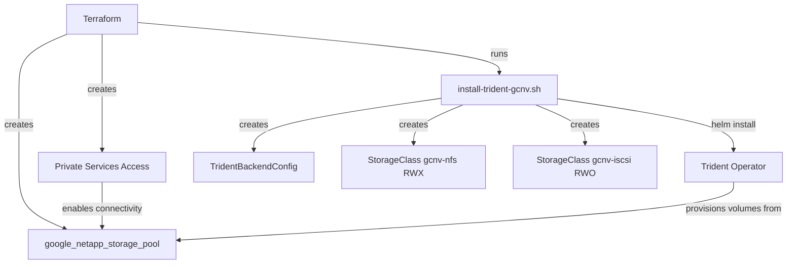

# Integrate Google Cloud NetApp Volumes (GCNV) with Trident

## Context

The project currently provisions block storage for OpenShift Virtualization via Hyperdisk Balanced (`hyperdisk.tf`). GCNV provides NetApp ONTAP-based storage on GCP with NFS (RWX) and iSCSI (block) support. Trident is the CSI orchestrator that connects Kubernetes/OpenShift to GCNV backends. This mirrors the recommended AWS pattern of FSx for NetApp ONTAP + Trident.

## Architecture



## 1. Terraform: GCP networking prerequisites (Private Services Access)

GCNV requires Private Services Access on the VPC. Add to a new `gcnv.tf`:

- `google_compute_global_address` -- reserve a /16 CIDR for NetApp peering
- `google_service_networking_connection` -- peer the VPC with `servicenetworking.googleapis.com`

Both gated behind a new `enable_gcnv` variable (default `false`).

```hcl
resource "google_compute_global_address" "gcnv_private_ip" {
  count         = var.enable_gcnv ? 1 : 0
  name          = "${var.clustername}-gcnv-ip"
  purpose       = "VPC_PEERING"
  address_type  = "INTERNAL"
  prefix_length = 16
  network       = google_compute_network.vpc_network.id
}

resource "google_service_networking_connection" "gcnv_peering" {
  count                   = var.enable_gcnv ? 1 : 0
  network                 = google_compute_network.vpc_network.id
  service                 = "servicenetworking.googleapis.com"
  reserved_peering_ranges = [google_compute_global_address.gcnv_private_ip[0].name]
}
```

## 2. Terraform: GCNV storage pool

Use the `google_netapp_storage_pool` resource (hashicorp/google provider >= 5.13.0). Add to `gcnv.tf`:

```hcl
resource "google_netapp_storage_pool" "gcnv" {
  count          = var.enable_gcnv ? 1 : 0
  name           = "${var.clustername}-gcnv-pool"
  location       = var.gcp_region
  service_level  = var.gcnv_service_level   # "FLEX", "STANDARD", "PREMIUM", "EXTREME"
  capacity_gib   = var.gcnv_capacity_gib    # e.g. 2048
  network        = google_compute_network.vpc_network.id
  depends_on     = [google_service_networking_connection.gcnv_peering]
}
```

## 3. Variables

Add to `variables.tf`:

- `enable_gcnv` (bool, default `false`) -- gate all GCNV resources and scripts
- `gcnv_service_level` (string, default `"PREMIUM"`) -- FLEX / STANDARD / PREMIUM / EXTREME
- `gcnv_capacity_gib` (number, default `2048`) -- pool capacity in GiB
- `gcnv_trident_version` (string, default `"26.02.0"`) -- Trident Helm chart version

## 4. Shell script: `scripts/install-trident-gcnv.sh`

Follow the pattern of `scripts/install-hyperdisk-storageclass.sh`. The script should:

1. **Install Trident via Helm** (if not already installed)
   - `helm repo add netapp-trident https://netapp.github.io/trident-operator`
   - `helm install trident-operator netapp-trident/trident-operator -n trident --create-namespace --set cloudProvider=GCP`
   - Wait for TridentOrchestrator to reach `Installed` status
2. **Create TridentBackendConfig** for NAS (NFS/RWX)
   - driver: `google-cloud-netapp-volumes`
   - projectNumber, location, network from env vars
3. **Create TridentBackendConfig** for SAN (iSCSI/block) -- optional, for VM workloads
   - driver: `google-cloud-netapp-volumes-san`
4. **Create StorageClasses**
   - `gcnv-nfs` (RWX, `backendType: google-cloud-netapp-volumes`, `nasType: nfs`)
   - `gcnv-iscsi` (RWO/block, `backendType: google-cloud-netapp-volumes-san`) -- optional

Environment variables passed from Terraform: `GCP_PROJECT`, `GCP_PROJECT_NUMBER`, `GCP_REGION`, `VPC_NETWORK`, `TRIDENT_VERSION`.

## 5. Terraform: wire the script into `main.tf`

Add a `shell_script` resource similar to `install_hyperdisk_storageclass`:

```hcl
resource "shell_script" "install_trident_gcnv" {
  count = var.only_deploy_infra_no_osd || !var.enable_gcnv ? 0 : 1

  lifecycle_commands {
    create = file("${path.module}/scripts/install-trident-gcnv.sh")
    delete = file("${path.module}/scripts/htpasswd-destroy-noop.sh")
  }

  environment = {
    GCP_PROJECT        = var.gcp_project
    GCP_REGION         = var.gcp_region
    VPC_NETWORK        = google_compute_network.vpc_network.name
    TRIDENT_VERSION    = var.gcnv_trident_version
  }

  working_directory = path.module
  interpreter       = ["/bin/bash", "-c"]

  depends_on = [shell_script.oc_login, google_netapp_storage_pool.gcnv]
}
```

## 6. Outputs

Add to `output.tf`:

- `gcnv_storage_pool_name` -- pool name for reference
- `gcnv_storage_pool_location` -- region

## 7. Update tfvars example

Add `enable_gcnv = false` (and commented-out GCNV variables) to `configuration/tfvars/terraform.tfvars`.

## Open questions / considerations

- **iSCSI SAN backend**: GCNV iSCSI is still rolling out to GA. Check if it is available in the target region. The NAS (NFS) backend is GA everywhere.
- **Trident version**: 25.02+ is required for OpenShift Virtualization support. Default to 26.02.0 (latest).
- **GCP project number**: Trident backend config requires the project _number_ (not project ID). The script can resolve this via `gcloud projects describe $GCP_PROJECT --format='value(projectNumber)'`.
- **Relationship to Hyperdisk**: GCNV and Hyperdisk can coexist. Hyperdisk remains the default virt StorageClass; GCNV provides a complementary NFS/RWX option and optionally a Trident-managed iSCSI option.
